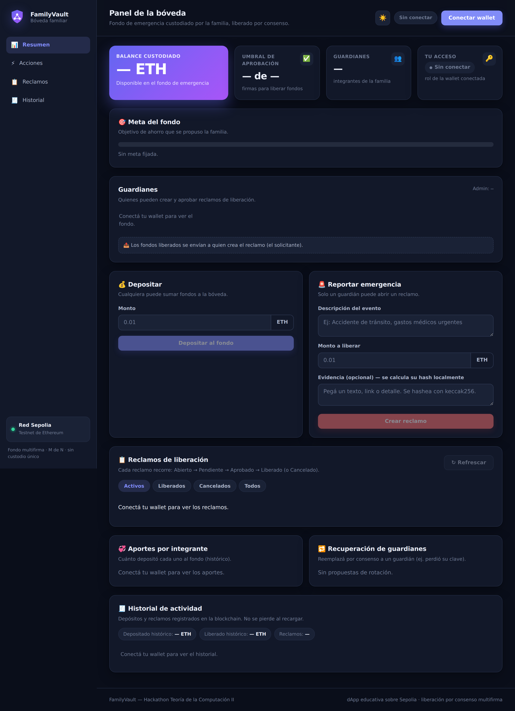
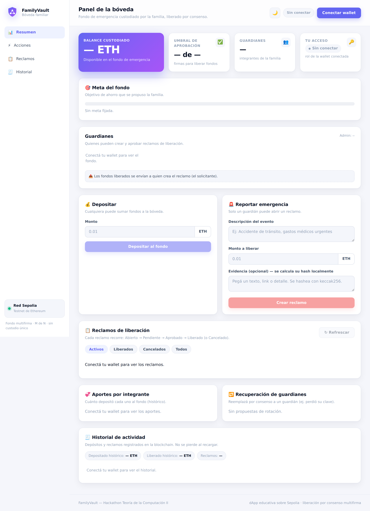

# 🛡️ Bóveda Familiar (FamilyVault)

> Fondo de ahorro de emergencia familiar custodiado por un contrato inteligente
> en la blockchain. Los fondos **solo se liberan cuando un mínimo de integrantes
> (M de N) certifica en la cadena que ocurrió una emergencia**. Así, ninguna
> persona sola puede usar mal el dinero y cada liberación queda registrada de
> forma transparente e inviolable.

Proyecto desarrollado para el **Hackathon de Teoría de la Computación II**.

---

## 📌 El problema

Las familias no tienen una forma confiable de guardar un fondo de emergencia que:

- **no pueda vaciar una sola persona** (como pasa con una cuenta bancaria
  compartida o el efectivo en casa), y
- **se libere solo cuando la familia acuerda** que efectivamente hay una
  emergencia (sin depender de un único custodio de confianza).

Esto golpea especialmente a **familias separadas geográficamente** (migrantes,
hijos estudiando lejos), donde coordinar el dinero de emergencia es difícil y
arriesgado.

## 💡 La solución

Un **contrato inteligente multifirma (M de N)** que custodia el fondo y lo libera
**por consenso**. Cada pedido de liberación es un *reclamo* que recorre una
**máquina de estados** y solo termina liberando los fondos **a quien lo solicitó**
cuando alcanza el umbral de aprobaciones definido por la familia.

- Ninguna persona sola ni una minoría puede tocar los fondos.
- Cada acción (depósito, reclamo, aprobación, liberación, cancelación, rotación)
  queda registrada como **evento público** en la blockchain, verificable por cualquiera.
- No hay backend ni base de datos: **la blockchain es la base de datos** compartida
  e inviolable. La familia mantiene el control total (solución **no-custodial**).

## ✨ Funcionalidades

- 💰 **Depósitos** de cualquiera al fondo común.
- 🚨 **Reclamos de emergencia** con descripción, monto y hash de evidencia.
- ✍️ **Aprobación multifirma (M de N)**; al alcanzar el umbral se liberan los fondos
  **al solicitante**.
- 🚫 **Cancelación** de un reclamo por su autor o el admin (estado `Cancelado`).
- 🎯 **Meta de ahorro** del fondo con barra de progreso.
- 🔁 **Recuperación social de guardianes**: reemplazar por consenso a un integrante
  que perdió su clave.
- 🏭 **Multi-familia**: un contrato `FamilyVaultFactory` permite que cualquier familia
  cree su propia bóveda (escala a uso masivo sin base de datos central).
- 📊 **Historial on-chain**, estadísticas y aportes por integrante.
- 🌗 Interfaz **SaaS** con tema claro/oscuro, notificaciones y confeti al liberar.

## ⚙️ Cómo funciona (flujo de uso)

1. **Despliegue:** un integrante despliega el contrato indicando los **guardianes**
   (las direcciones de la familia) y el **umbral M** (ej. 3 de 4).
2. **Depositar:** cualquiera suma ETH de prueba al fondo.
3. **Reportar emergencia:** un guardián crea un **reclamo** (descripción + hash de
   evidencia opcional + monto a liberar). Estado inicial: **Abierto**.
4. **Aprobar:** los guardianes aprueban el reclamo. Cada aprobación es una firma
   con su clave privada. El estado pasa a **Pendiente**.
5. **Liberación automática:** cuando se alcanza el umbral M, el contrato pasa el
   reclamo a **Aprobado → Liberado** y transfiere los fondos **al solicitante**, todo
   en la misma transacción.

```
Abierto ──► Pendiente ──► Aprobado ──► Liberado        (cancelar) ──► Cancelado
 (creado)   (aprob<M)     (aprob==M)   (al solicitante)
```

Detalle del autómata: ver [`docs/diagrama-estados.md`](docs/diagrama-estados.md).

## 🖼️ Capturas

| Tema oscuro | Tema claro |
|-------------|------------|
|  |  |

## 🧱 Stack tecnológico

| Capa            | Tecnología                                                        |
|-----------------|-------------------------------------------------------------------|
| Contrato        | **Solidity** (`^0.8.20`), desplegado en la testnet **Sepolia**    |
| Frontend        | **HTML + CSS + JavaScript vanilla** (sin frameworks)              |
| Librería Web3   | **ethers.js v6** (desde CDN, build UMD)                           |
| Wallet / firmas | **MetaMask** (`window.ethereum`)                                  |
| Backend         | **Ninguno** — dApp pura, el frontend habla directo con la cadena  |
| Hosting         | Estático: **Vercel** o local                                      |

No hay API keys ni secretos: todo lo que va a la cadena es público.

## 🗂️ Estructura del proyecto

```
familyvault/
├── index.html                 # UI de la dApp
├── style.css                  # Estilos
├── app.js                     # Lógica web3 (ethers.js v6 + MetaMask)
├── config.js                  # Dirección del contrato + red + ABI embebido
├── contract/
│   ├── FamilyVault.sol         # Contrato (máquina de estados + seguridad + eventos)
│   ├── FamilyVaultFactory.sol  # Fábrica multi-familia (uso masivo)
│   ├── mocks/AtacanteReentrancy.sol  # Contrato atacante (solo para tests)
│   ├── FamilyVault.abi.json    # ABI (reemplazar por el exacto de Remix si recompilás)
│   └── DEPLOY.md               # Guía paso a paso de despliegue y guion de demo
├── docs/
│   ├── memoria-tecnica.md     # Memoria técnica (9 secciones del PDF)
│   ├── lean-canvas.md         # Lean Canvas completo
│   ├── pitch-deck.md          # Pitch deck diapositiva por diapositiva
│   ├── diagrama-estados.md    # Máquina de estados del reclamo
│   ├── guia-defensa.md        # Guía para la presentación oral
│   └── img/                   # Capturas de la interfaz
├── test/                      # (Opcional) tests de Hardhat
├── vercel.json
├── .gitignore
└── README.md
```

## 🚀 Cómo desplegar y correr

La guía completa (instalar MetaMask, agregar Sepolia, conseguir ETH de prueba,
compilar y desplegar en Remix, conectar el frontend y el **guion de demo para el
video**) está en **[`contract/DEPLOY.md`](contract/DEPLOY.md)**.

Resumen rápido:

1. **Desplegar el contrato** (Remix → Sepolia) pasando los **guardianes** y el
   **umbral**. Copiar la dirección.
2. **Configurar el frontend:** pegar la dirección en `config.js`
   (`CONTRACT_ADDRESS`) y los nombres en `NOMBRES`. El ABI ya viene embebido.
3. **Correr el frontend** localmente:
   ```bash
   python3 -m http.server 5500
   # abrir http://localhost:5500
   ```
   o desplegarlo en Vercel (ver abajo).

### Desplegar el frontend en Vercel

El frontend es estático, así que el deploy es directo:

1. Subí el repo a GitHub (ver "Crear el repositorio").
2. Entrá a <https://vercel.com>, **New Project** → importá el repo.
3. Framework Preset: **Other** (no hay build). Output: raíz del repo.
4. **Deploy.** Vercel te da una URL pública.

> Importante: el `CONTRACT_ADDRESS` de `config.js` debe estar completo **antes**
> de deployar (o redeployá después de completarlo).

### Crear el repositorio en GitHub

```bash
# Este proyecto ya está bajo git. Para publicarlo en un repo nuevo:
# 1) Creá un repo público vacío en https://github.com/new (ej. familyvault)
# 2) Conectalo y empujá:
git remote add origin https://github.com/TU_USUARIO/familyvault.git
git branch -M main
git push -u origin main
```

## 🔒 Seguridad (decisiones de diseño)

- **Control de acceso:** solo guardianes pueden crear/aprobar reclamos; solo el
  admin configura (modificadores `soloGuardian` / `soloAdmin`).
- **Anti-reentrancy:** patrón **checks-effects-interactions** (el estado se marca
  `Liberado` *antes* de transferir el ETH) + candado `noReentrante` como defensa
  en profundidad.
- **Validaciones de estado:** no se puede aprobar dos veces el mismo guardián
  (`aprobadoPor`), ni liberar/cancelar dos veces un reclamo.
- **Eventos:** cada acción emite un evento para dejar traza pública auditable.
- **Tests (Hardhat):** **27 pruebas** cubren depósito, control de acceso, anti
  doble-aprobación, liberación al umbral, cancelación, meta, rotación de guardianes,
  la fábrica multi-familia y un **test de reentrancy** con un contrato atacante que
  intenta drenar fondos y es rechazado. Correr con `npm install && npx hardhat test`.

## 📦 Entregables del trabajo (mapa para el jurado)

| Entregable obligatorio | Dónde está |
|------------------------|------------|
| **README principal** | este archivo |
| **Lean Canvas** | [docs/lean-canvas.md](docs/lean-canvas.md) |
| **Memoria técnica** (9 secciones) | [docs/memoria-tecnica.md](docs/memoria-tecnica.md) |
| **Pitch Deck** | [docs/pitch-deck.md](docs/pitch-deck.md) |
| **Evidencias del MVP** | [docs/evidencias-mvp.md](docs/evidencias-mvp.md) |
| **Video demo** | enlace en "Enlaces y entregables" (abajo) |

Material complementario: [diagrama de estados](docs/diagrama-estados.md) ·
[guía de defensa](docs/guia-defensa.md) · [guía de despliegue y demo](contract/DEPLOY.md).

## 📚 Documentación

- [Memoria técnica](docs/memoria-tecnica.md) — las 9 secciones exigidas.
- [Lean Canvas](docs/lean-canvas.md)
- [Evidencias del MVP](docs/evidencias-mvp.md)
- [Pitch deck](docs/pitch-deck.md)
- [Diagrama de estados](docs/diagrama-estados.md)
- [Guía de despliegue y demo](contract/DEPLOY.md)

## 🤖 Sobre el uso de IA

**El producto NO incorpora ninguna funcionalidad de IA.** La inteligencia
artificial (Claude / **Claude Code**) se usó únicamente como **herramienta de
desarrollo** para acelerar la programación, aplicar patrones de seguridad y
generar documentación. Detalle en la memoria técnica, sección 4.

---

## 🔗 Enlaces y entregables (completar)

- **Repositorio:** `[link al repo de GitHub]`
- **Contrato desplegado (Sepolia):** `0xfcA81001f59b6d56654bE6474776258E97674804`
  → [ver en Etherscan](https://sepolia.etherscan.io/address/0xfcA81001f59b6d56654bE6474776258E97674804)
- **dApp en vivo (Vercel):** `[link de la URL pública]`
- **Video de la demo:** `[link al video]`

## 🖼️ Capturas (placeholders)

- `[ Captura: panel del fondo con balance, guardianes y umbral ]`
- `[ Captura: reclamo en estado Pendiente con progreso 2/3 ]`
- `[ Captura: reclamo Liberado + evento en Etherscan ]`

---

## 👥 Equipo

| Integrante | Rol |
|------------|-----|
| **Lucas** | 🔗 Blockchain / Smart Contract |
| **Adriano** | 💻 Frontend / Integración Web3 |
| **Nahuel Mosconi** | 📄 Documentación / Investigación |
| **Ignacio Escarcha** | 🎤 Coordinación / Pitch |

## Licencia

MIT.
