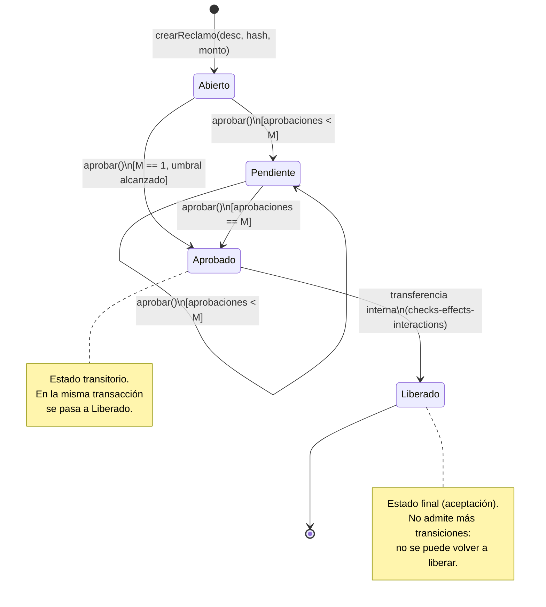

# Diagrama de estados — Ciclo de vida de un reclamo

> Este documento modela cada **reclamo de liberación de fondos** de FamilyVault
> como una **máquina de estados finita (autómata finito)**. Es la conexión
> directa con Teoría de la Computación II: definimos un conjunto finito de
> estados, un alfabeto de eventos (símbolos de entrada) y una función de
> transición determinista.

## Definición formal del autómata

Modelamos el reclamo como un autómata finito determinista (AFD) `A = (Q, Σ, δ, q₀, F)`:

- **Q** (conjunto de estados): `{ Abierto, Pendiente, Aprobado, Liberado }`
- **Σ** (alfabeto / eventos de entrada):
  - `aprobar_sub` → llega una aprobación y el total sigue **por debajo** del umbral M.
  - `aprobar_umbral` → llega una aprobación que **alcanza** el umbral M.
- **q₀** (estado inicial): `Abierto` (al ejecutarse `crearReclamo`).
- **F** (estados de aceptación / finales): `{ Liberado }`.
- **δ** (función de transición): definida en la tabla de abajo.

> Nota de implementación: en el contrato, `Aprobado` es un estado **transitorio**.
> Cuando se alcanza el umbral, la misma transacción avanza de `Aprobado` a
> `Liberado` de forma atómica (aplicando checks-effects-interactions antes de
> transferir el ETH). Lo modelamos como dos estados separados porque
> conceptualmente "umbral alcanzado" y "fondos transferidos" son momentos
> distintos del ciclo de vida.

## Tabla de transición δ

| Estado actual | Evento (símbolo)   | Estado siguiente | Condición / efecto                                  |
|---------------|--------------------|------------------|-----------------------------------------------------|
| Abierto       | `aprobar_sub`      | Pendiente        | `aprobaciones < M` · suma 1 aprobación              |
| Abierto       | `aprobar_umbral`   | Aprobado→Liberado| `M == 1` · alcanza umbral y transfiere              |
| Pendiente     | `aprobar_sub`      | Pendiente        | sigue `< M` · suma 1 aprobación                     |
| Pendiente     | `aprobar_umbral`   | Aprobado→Liberado| `aprobaciones == M` · transfiere al beneficiario    |
| Liberado      | (cualquiera)       | — (rechaza)      | estado final: `require(estado != Liberado)`         |

Transiciones **no válidas** (el contrato las revierte, son "palabras" no aceptadas):

- Aprobar dos veces el mismo guardián el mismo reclamo → `require(!aprobadoPor[...])`.
- Aprobar un reclamo ya `Liberado` → `require(estado != Liberado)`.
- Crear o aprobar siendo no-guardián → `modifier soloGuardian`.

## Diagrama (Mermaid)



## Diagrama (ASCII, por si el visor no renderiza Mermaid)

```
                    crearReclamo()
                          │
                          ▼
                    ┌───────────┐
                    │  ABIERTO  │  (0 aprobaciones)
                    └─────┬─────┘
                          │ aprobar()  [aprob < M]
                          ▼
                    ┌───────────┐ ◄─┐
                    │ PENDIENTE │   │ aprobar() [aprob < M]
                    └─────┬─────┘ ──┘
                          │ aprobar()  [aprob == M]
                          ▼
                    ┌───────────┐
                    │ APROBADO  │  (transitorio, umbral alcanzado)
                    └─────┬─────┘
                          │ transferencia interna
                          │ (estado = Liberado ANTES de mover ETH)
                          ▼
                    ┌───────────┐
                    │ LIBERADO  │  (final — fondos enviados al beneficiario)
                    └───────────┘
```

## Correspondencia con el código (`FamilyVault.sol`)

- `enum EstadoReclamo { Abierto, Pendiente, Aprobado, Liberado }` → conjunto **Q**.
- `crearReclamo(...)` → transición inicial a `q₀ = Abierto`.
- `aprobar(idReclamo)` → procesa un símbolo de Σ y aplica `δ`:
  - Si `aprobaciones < umbral` ⇒ `Pendiente`.
  - Si `aprobaciones >= umbral` ⇒ `Aprobado` y, atómicamente, `Liberado`.
- Las guardas (`require`) implementan el rechazo de transiciones inválidas, igual
  que un AFD no acepta símbolos fuera de su función de transición definida.
